# Sistema de Pedidos de Pizza - Interfaz Gráfica

## Introducción

Este documento detalla la construcción de la interfaz gráfica de usuario (GUI) utilizando Java Swing y NetBeans GUI Builder. La implementación se divide en 5 módulos secuenciales que deben completarse en orden.

Cada módulo es independiente y debe ser probado antes de continuar con el siguiente.

## Requisitos Previos

- NetBeans IDE instalado (versión 12 o superior)
- JDK 8 o superior
- Conocimientos básicos de Swing (revisados en `3.1.1 Interfaz Grafica.pdf`)

## Componentes Swing que Utilizaremos

| Componente | Propósito |
|------------|-----------|
| JFrame | Ventana principal |
| JPanel | Contenedores para organizar componentes |
| JLabel | Etiquetas de texto |
| JRadioButton | Selección única (tipo de pizza) |
| ButtonGroup | Agrupar radio buttons |
| JComboBox | Lista desplegable (tamaños) |
| JCheckBox | Selección múltiple (ingredientes) |
| JButton | Botones de acción |
| JTextArea | Área de texto (carrito) |
| JScrollPane | Scroll para el área de texto |

## Convención de Nomenclatura

Seguiremos el estándar de prefijos para nombrar componentes:

```
lbl  = JLabel
txt  = JTextField
txa  = JTextArea
btn  = JButton
opt  = JRadioButton (option)
chk  = JCheckBox
cbo  = JComboBox (combo)
panel = JPanel
```

**Ejemplos:**
- `lblTitulo` - Label para el título
- `btnAgregar` - Botón para agregar al carrito
- `optTradicional` - Radio button para pizza tradicional
- `chkJamon` - Checkbox para ingrediente jamón

---

## MÓDULO 1: Preparación del Proyecto

### Objetivo
Crear el proyecto en NetBeans y configurar la ventana principal (JFrame) con sus propiedades básicas.

### Paso 1.1: Crear Nuevo Proyecto

1. Abrir NetBeans IDE
2. Ir a **File > New Project**
3. Seleccionar **Java with Ant > Java Application**

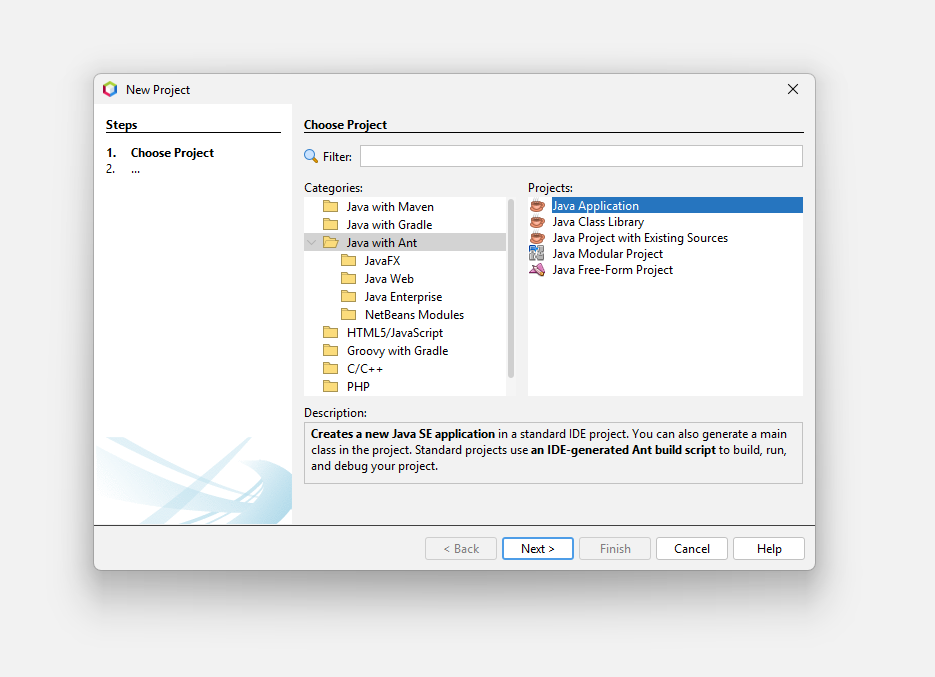

4. Configurar el proyecto:
   - **Project Name:** `SistemaPizzaPOO`
   - **Project Location:** Elegir carpeta deseada
   - **Create Main Class:** Desmarcar (crearemos JFrame)
5. Click en **Finish**

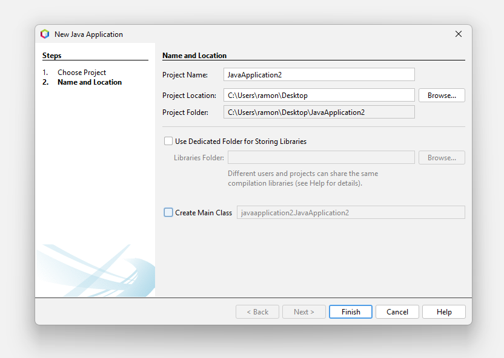

### Paso 1.2: Crear Estructura de Packages

Siguiendo la arquitectura MVC, crearemos los packages para organizar el código.

1. En el panel **Projects**, expandir el proyecto `SistemaPizzaPOO`
2. Click derecho sobre **Source Packages**
3. Seleccionar **New > Java Package...**

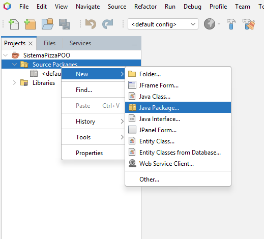

4. Crear los siguientes packages en orden (repetir pasos 2-3 para cada uno):

**Package 1: vista** (para la GUI)
```
Package Name: sistemapizzapoo.vista
```

**Package 2: modelo** (para las clases de negocio)
```
Package Name: sistemapizzapoo.modelo
```

**Package 3: interfaces** (para las interfaces POO)
```
Package Name: sistemapizzapoo.interfaces
```

Resultado final:

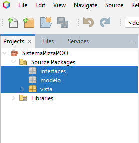

### Paso 1.3: Crear JFrame Principal

Ahora crearemos la ventana principal dentro del package `vista`.

1. Click derecho sobre el package **sistemapizzapoo.vista**
2. Seleccionar **New > JFrame Form...**

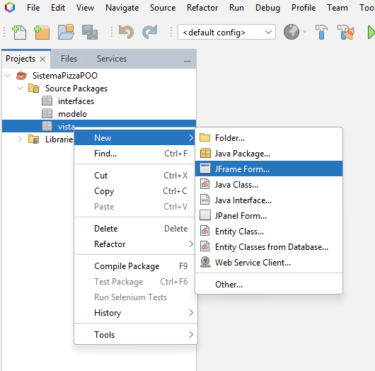

3. Configurar el JFrame:
   - **Class Name:** `VentanaPrincipal`
   - **Package:** `sistemapizzapoo.vista` (ya debe estar seleccionado)

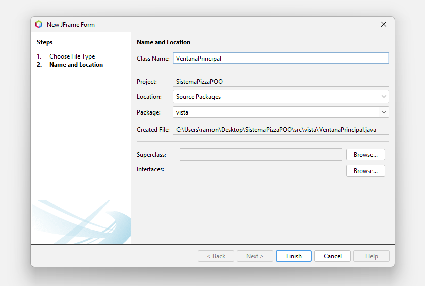

4. Click en **Finish**

NetBeans abrirá el GUI Builder (vista de diseño).

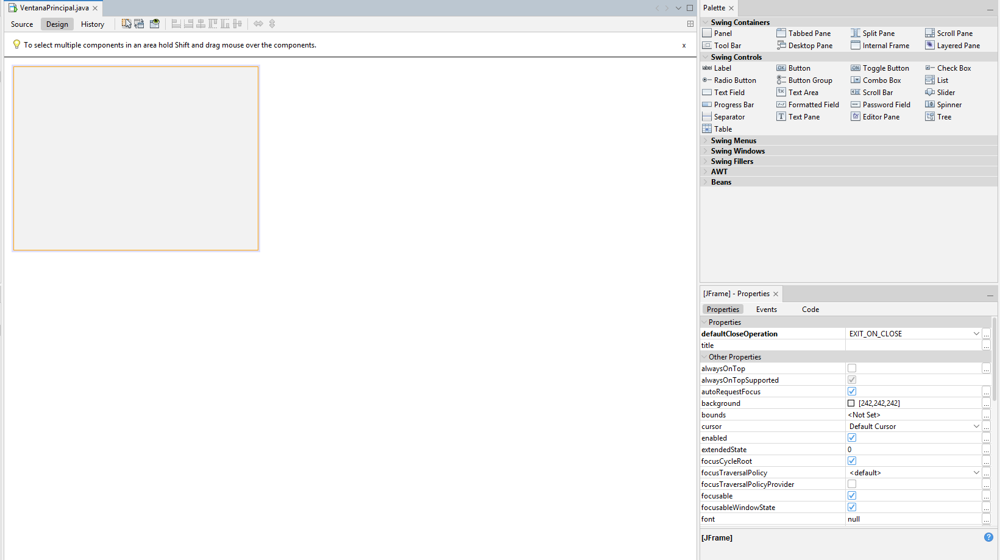

### Paso 1.4: Configurar Propiedades del JFrame

Con el JFrame seleccionado en el diseñador, la ventana **Properties** (lado derecho) muestra todas las propiedades configurables.

**Configurar las siguientes propiedades:**

1. Buscar y configurar **title**:
   - Valor: `Sistema de Pedidos - Pizzería POO`

2. Buscar y configurar **defaultCloseOperation**:
   - Valor: `EXIT_ON_CLOSE`

3. Buscar y configurar **preferredSize**:
   - Click en el botón `...` junto a preferredSize
   - Configurar: `width: 900, height: 650`


### Paso 1.5: Configurar el Layout Principal

Usaremos 3 paneles principales:

```
+-------------------------------------------+
| JFrame (VentanaPrincipal)                 |
| +---------------------------------------+ |
| | panelPrincipal (toda el área)         | |
| | +---------------+  +-----------------+ | |
| | | panelIzq      |  | panelDerecho   | | |
| | | (Crear Pizza) |  | (Carrito)      | | |
| | +---------------+  +-----------------+ | |
| |                                        | |
| | [btnFinalizar - centrado abajo]       | |
| +---------------------------------------+ |
+-------------------------------------------+
```

**Configurar Absolute Layout:**

1. Click derecho en el **JFrame** (en el diseñador)
2. Seleccionar **Set Layout > Absolute Layout** (para control manual de posiciones)

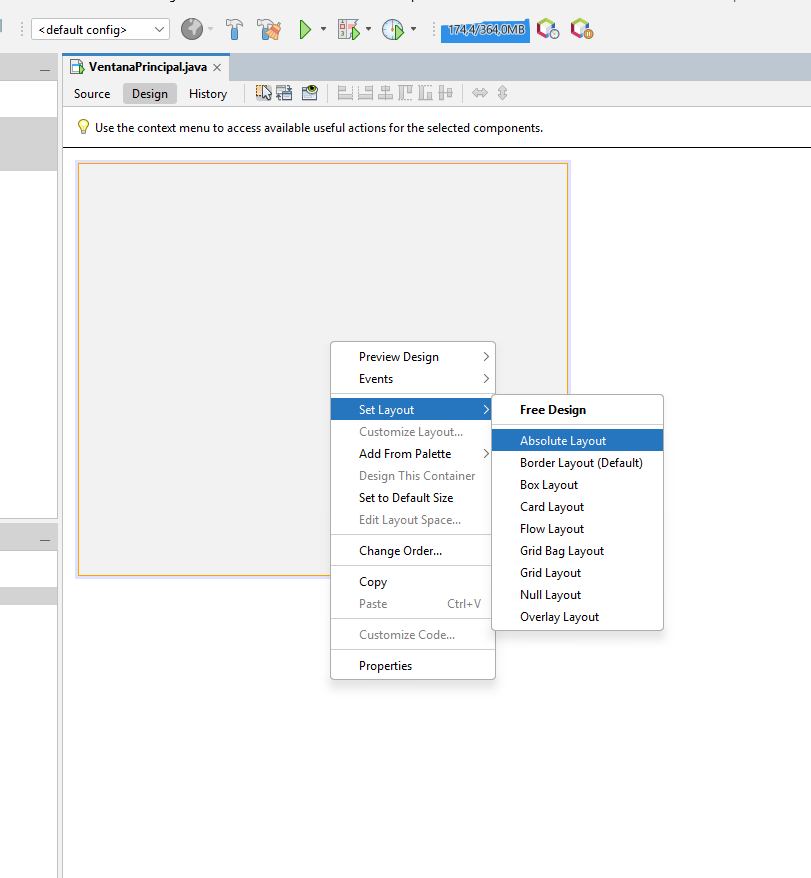

**Agregar Panel Principal:**

1. Desde la paleta (derecha), arrastrar un **JPanel** al JFrame

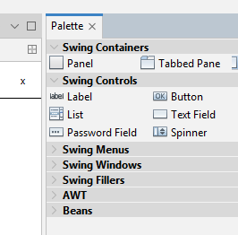

2. Nombrarlo: `panelPrincipal`
   - Seleccionar el JPanel en el diseñador (click sobre él)
   - En Properties, buscar **Variable Name**
   - Cambiar de `jPanel1` a `panelPrincipal`

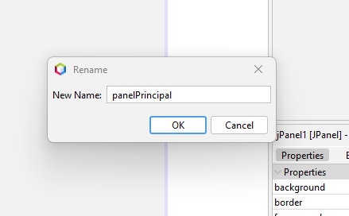

3. Redimensionar para ocupar todo el JFrame:
   - En Properties, buscar **preferredSize**
   - Configurar: `width: 900, height: 650`

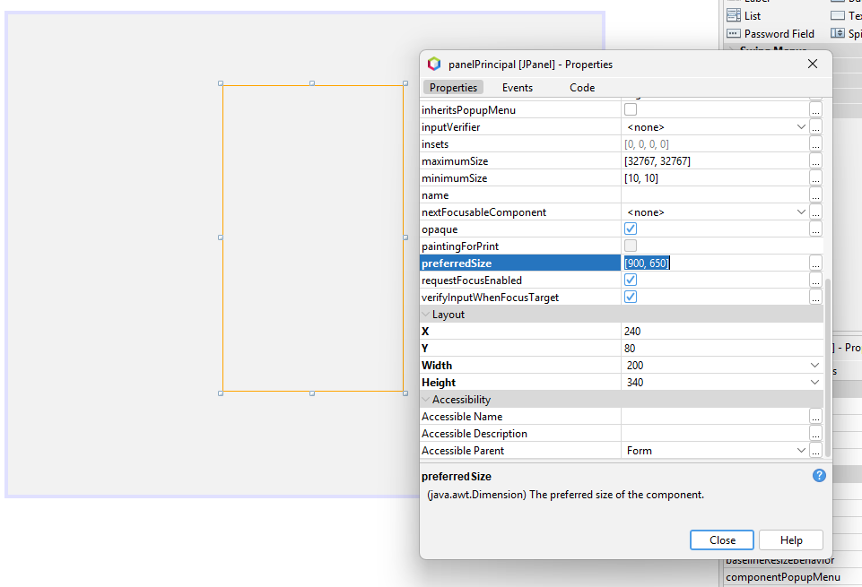

### Checklist Módulo 1

- [ ] Proyecto creado correctamente
- [ ] JFrame Form creado con nombre `VentanaPrincipal`
- [ ] Título configurado en el JFrame
- [ ] defaultCloseOperation configurado
- [ ] Tamaño de ventana: 900x650
- [ ] Panel principal agregado

### Probar Módulo 1

1. Click derecho en `VentanaPrincipal.java`
2. **Run File**
3. Debe aparecer una ventana vacía con el título correcto

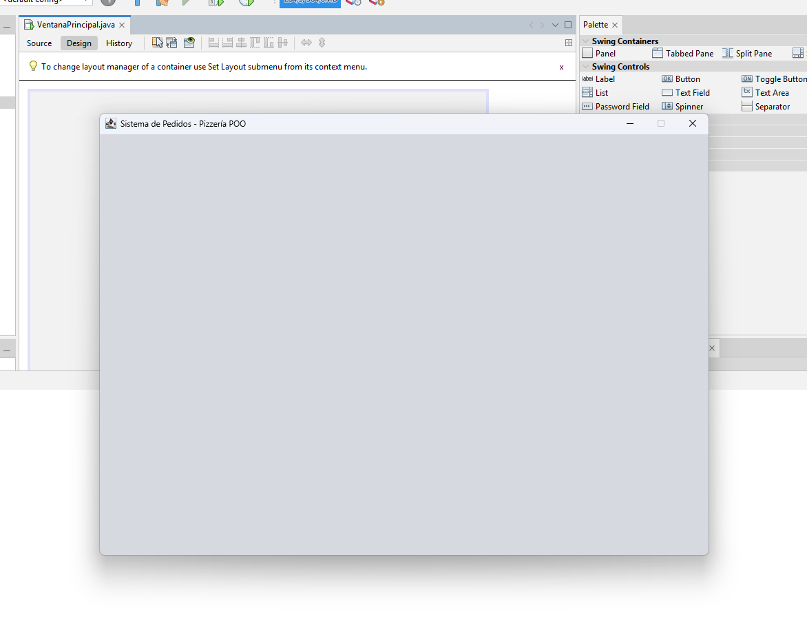

---

## MÓDULO 2: Módulo de Selección de Pizza

### Objetivo
Crear el panel izquierdo con componentes para seleccionar tipo y tamaño de pizza.

### Paso 2.1: Crear Panel Izquierdo

1. Arrastrar un **JPanel** dentro de `panelPrincipal`
2. Configurar propiedades:
   ```
   Variable Name: panelSeleccionPizza
   border: TitledBorder con título "CREAR PIZZA"
   background: Color blanco o gris claro
   ```
3. Posición: `x: 20, y: 20`
4. Tamaño: `width: 400, height: 500`

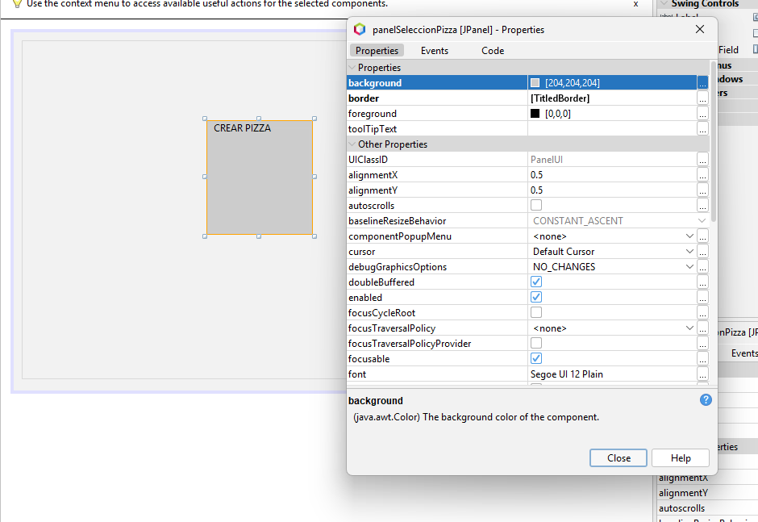

### Paso 2.2: Agregar Título de Sección

1. Arrastrar un **JLabel** dentro de `panelSeleccionPizza`
2. Configurar:
   ```
   Variable Name: lblTipoPizza
   text: "Tipo de Pizza:"
   font: Arial, Bold, 14pt
   ```
3. Posición: `x: 20, y: 30`

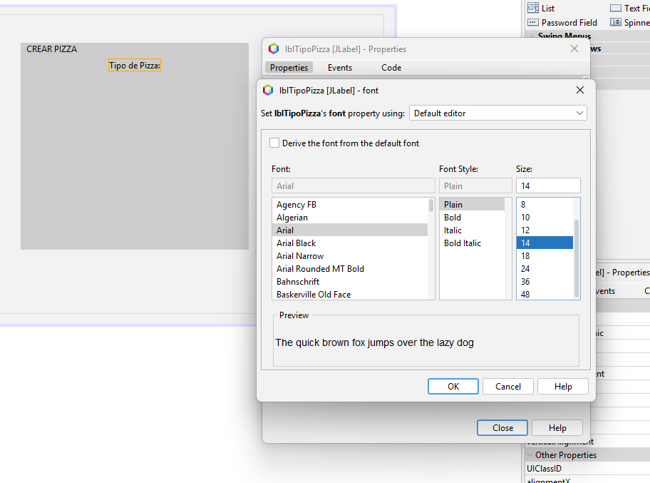

### Paso 2.3: Agregar Radio Buttons para Tipo de Pizza

Necesitamos 3 radio buttons agrupados.

**Radio Button 1: Tradicional**
1. Arrastrar **JRadioButton** al panel
2. Configurar:
   ```
   Variable Name: optTradicional
   text: "Tradicional - $8.000"
   font: 12pt
   ```
3. Posición: `x: 30, y: 60`

**Radio Button 2: Premium**
1. Arrastrar otro **JRadioButton**
2. Configurar:
   ```
   Variable Name: optPremium
   text: "Premium - $12.000"
   font: 12pt
   ```
3. Posición: `x: 30, y: 90`

**Radio Button 3: Personalizada**
1. Arrastrar otro **JRadioButton**
2. Configurar:
   ```
   Variable Name: optPersonalizada
   text: "Personalizada - $10.000 + extras"
   font: 12pt
   selected: true (marcado por defecto)
   ```
3. Posición: `x: 30, y: 120`

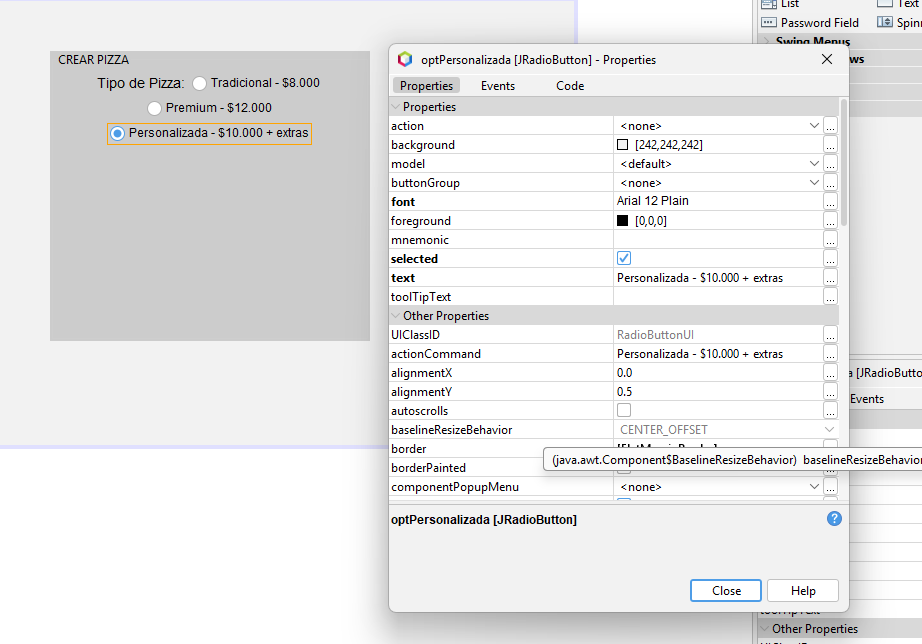

### Paso 2.4: Agrupar Radio Buttons con ButtonGroup

**IMPORTANTE:** Los radio buttons deben estar en un ButtonGroup para que solo uno pueda estar seleccionado.

1. En la paleta, buscar **ButtonGroup** (sección Swing Controls)
2. Arrastrarlo al JFrame (aparecerá en la bandeja inferior)
3. Nombrarlo: `bgTipoPizza`

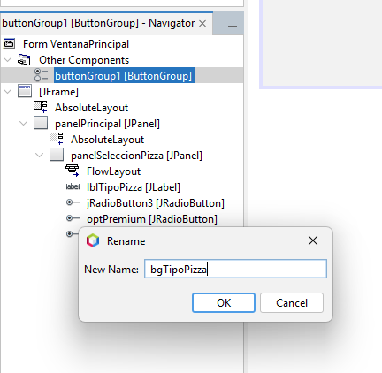

4. Asignar cada radio button al grupo:
   - Click en `optTradicional`
   - En Properties, buscar `buttonGroup`
   - Seleccionar `bgTipoPizza` del dropdown
   - Repetir para `optPremium` y `optPersonalizada`

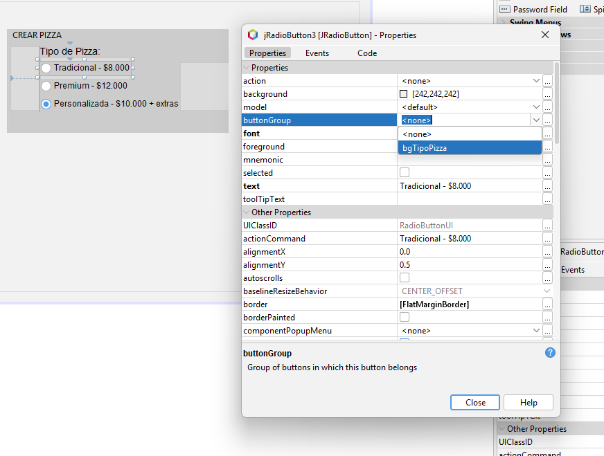

### Paso 2.5: Agregar Selector de Tamaño

Ahora agregaremos un label y un combobox **dentro del mismo `panelSeleccionPizza`** para seleccionar el tamaño de la pizza.

**Label para tamaño:**
1. Arrastrar **JLabel** dentro de `panelSeleccionPizza`
2. Configurar:
   ```
   Variable Name: lblTamano
   text: "Tamaño:"
   font: Bold, 14pt
   ```
3. Posición: `x: 20, y: 170`

**ComboBox para tamaños:**
1. Arrastrar **JComboBox** al panel
2. Configurar:
   ```
   Variable Name: cboTamano
   model: Editar items...
   ```
3. En el editor de model, agregar:
   ```
   Pequeña
   Mediana
   Familiar
   ```
4. Configurar `selectedIndex: 1` (Mediana por defecto)
5. Posición: `x: 30, y: 200`
6. Tamaño: `width: 200`

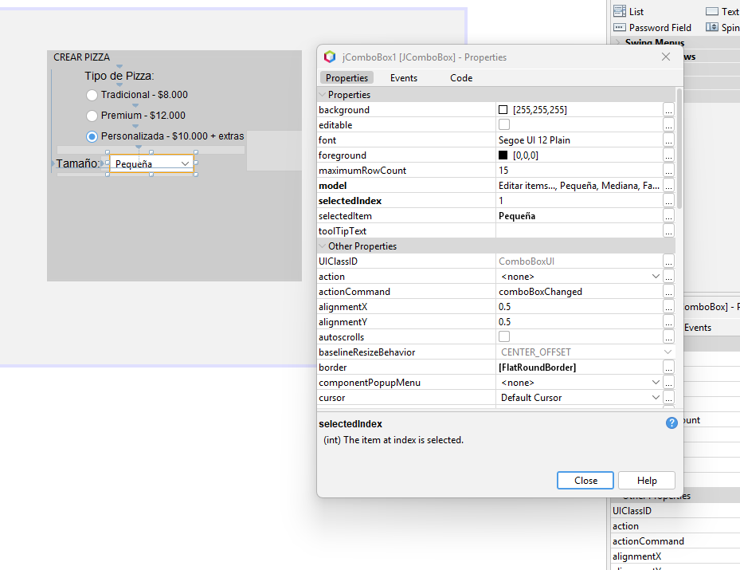

### Paso 2.6: Agregar Label de Precio

Agregaremos dos labels **dentro del mismo `panelSeleccionPizza`** para mostrar el precio total de la pizza.

1. Arrastrar **JLabel** dentro de `panelSeleccionPizza` para el texto "Precio:"
2. Configurar:
   ```
   Variable Name: lblPrecioTexto
   text: "Precio Total:"
   font: Bold, 14pt
   ```
3. Posición: `x: 20, y: 430`

4. Arrastrar otro **JLabel** para el valor
5. Configurar:
   ```
   Variable Name: lblPrecioValor
   text: "$0"
   font: Bold, 18pt
   foreground: Color verde oscuro
   ```
6. Posición: `x: 150, y: 425`

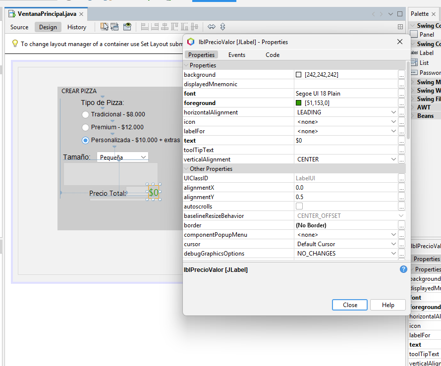

### Paso 2.7: Configurar Eventos Básicos

Ahora configuraremos los event listeners (sin lógica aún, solo para probar).

**Evento para Radio Buttons:**

Para cada radio button:
1. Click derecho en `optTradicional`
2. **Events > Action > actionPerformed**
3. NetBeans genera el método. Agregar solo un print:

```java
private void optTradicionalActionPerformed(java.awt.event.ActionEvent evt) {
    System.out.println("Seleccionado: Tradicional");
}
```

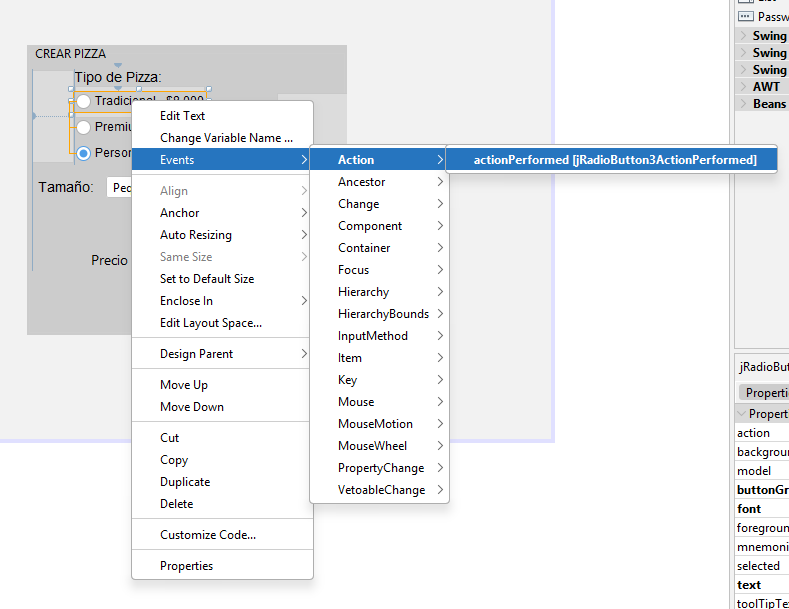

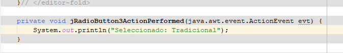

Repetir para `optPremium` y `optPersonalizada`.

**Evento para ComboBox:**

1. Click derecho en `cboTamano`
2. **Events > Action > actionPerformed**
3. Agregar:

```java
private void cboTamanoActionPerformed(java.awt.event.ActionEvent evt) {
    // Castear a String porque getSelectedItem() retorna Object
    String tamano = (String) cboTamano.getSelectedItem();
    System.out.println("Tamaño seleccionado: " + tamano);
}
```

[SCREENSHOT: Código del event handler en NetBeans]

### Checklist Módulo 2

- [ ] Panel izquierdo creado con borde titulado
- [ ] Label "Tipo de Pizza" agregado
- [ ] 3 radio buttons agregados y configurados
- [ ] ButtonGroup creado y radio buttons asignados
- [ ] Label "Tamaño" agregado
- [ ] ComboBox con 3 opciones configurado
- [ ] Labels de precio agregados
- [ ] Event listeners configurados (con prints)

### Probar Módulo 2

1. **Run File**
2. Verificar que:
   - Solo un radio button puede estar seleccionado a la vez
   - Al cambiar selección, aparece mensaje en consola
   - ComboBox muestra las 3 opciones
   - Al cambiar tamaño, aparece mensaje en consola

[SCREENSHOT: Ventana ejecutándose con Módulo 2 completo]

---

## Continuar con la Parte 2

Los Módulos 3, 4 y 5 se encuentran en el documento de continuación.

**Siguiente documento:** [03-interfaz-grafica-continuacion.md](03-interfaz-grafica-continuacion.md)

En la Parte 2 completaremos:
- **Módulo 3:** Panel de ingredientes personalizables con checkboxes
- **Módulo 4:** Panel de carrito con área de texto y botones
- **Módulo 5:** Integración completa con eventos de agregar y finalizar pedido

---

## Referencias

- Documentación oficial Java Swing: https://docs.oracle.com/javase/tutorial/uiswing/
- NetBeans GUI Builder Guide: https://netbeans.apache.org/tutorial/main/kb/docs/java/quickstart-gui/
- Material del curso: `3.1.1 Interfaz Grafica.pdf`
- Documento de arquitectura: [01-README.md](01-README.md)
